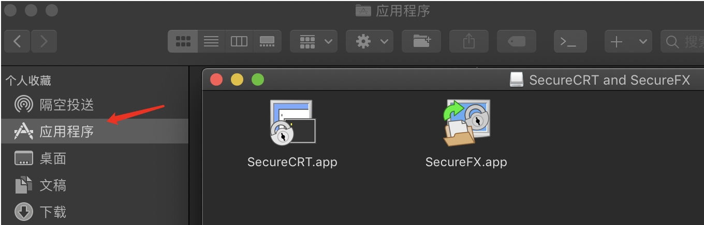
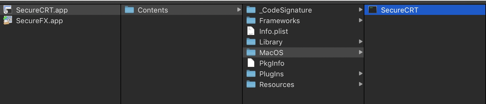

# Mac上安装SecureCRT&SecureFX

### 参考链接

CSDN:   <https://blog.csdn.net/liuayng/article/details/69372222>

yuque:  <https://www.yuque.com/bwlab/crack/olftl3>

#### 第一步：SecureCRT官网下载自己系统版本及位数的文件

下载地址：<https://www.vandyke.com/cgi-bin/releases.php?product=securecrt>

下载的是 scrt-sfx-8.5.3-1867.osx_x64.dmg * [(scrt-sfx-8.5.3-1867.osx_x64.dmg)](https://www.vandyke.com/cgi-bin/account_login.php?pid=scrt_sfx_macx64_853)

#### 第二步：破解

（1） 打开dmg文件，将文件中的两个app移动到应用程序。

（2）在应用程序里面找到刚才拖动过去的app文件，选中->右键->显示包内容，跟随文件夹到MacOS目录下。

使用option+command+c复制SecureCRT的路径，使用以下路径进入终端。
```
cd /Applications/SecureCRT.app/Contents/MacOS/>
```
依次执行下面的语句：
```
    	cat SecureCRT  | od -A n -v -t x1 | tr -d ' \n' >SecureCRTHEX.txt
	mv SecureCRT SecureCRT_backup
	sed -i 's/6e533e406a45f0b6372f3ea10717000c7120127cd915cef8ed1a3f2c5b/785782391ad0b9169f17415dd35f002790175204e3aa65ea10cff20818/g' SecureCRTHEX.txt
	cat SecureCRTHEX.txt | xxd -r -p > SecureCRT
	rm SecureCRTHEX.txt SecureCRT_backup
```
如果遇到`sed -i`语句报错，请使用这条语句：
```
sed -i '' 's/6e533e406a45f0b6372f3ea10717000c7120127cd915cef8ed1a3f2c5b/785782391ad0b9169f17415dd35f002790175204e3aa65ea10cff20818/g' SecureCRTHEX.txt
```
#### 第三步：注册

运行SecureCRT，输入License

```
	Name: ygeR

	Company: TEAM ZWT

	Serial Number:03-36-338639

	License Key: ADJE19 7U19YF 46RJWC 3CGK73 ADF3GN S66TJJ YU7BJP 6WJF1G

	Issue Date: 03-10-2017
```
#### SecureFX
SecureFX的过程也如上，不同的是，执行的下面这些命令：
```
    	cat SecureFX  | od -A n -v -t x1 | tr -d ' \n' > SecureFXHEX.txt
    	mv SecureFX SecureFX_backup
    	sed -i 's/c847abca184a6c5dfa47dc8efcd700019dc9df3743c640f50be307334fea/e02954a71cca592c855c91ecd4170001d6c606d38319cbb0deabebb05126/g' SecureFXHEX.txt
    	cat SecureFXHEX.txt  | xxd -r -p > SecureFX
    	rm SecureFX_backup SecureFXHEX.txt
```
运行SecureFX，输入License
```
	Name: ygeR
 
	Company: TEAM ZWT
 
	Serial Number:06-70-001589
 
	License Key: ACUYJV Q1V2QU 1YWRCN NBYCYK ABU767 D4PQHA S1C4NQ GVZDQF
 
	Issue Date: 03-10-2017
```


### 注：程序只提供测试，请测试完成后删除程序，需要使用请购买正版软件，谢谢！
